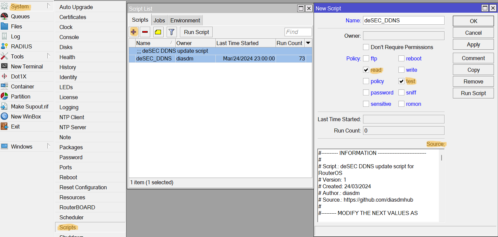

<h1 align="center">deSEC DDNS update</h1>
<p align="center">
</p>

<BR>

A simple yet effective RouterOS script that updates a [**deSEC.io**](https://desec.io) domain name with the latest WAN IPv4 and IPv6 addresses. It uses [**deSEC's API**](https://desec.readthedocs.io/en/latest) to push update
s.

<BR>

## DOWNLOAD

[▶️ deSEC DDNS script for Mikrotik RouterOS](./mt_desec_ddns.rsc)

<BR>

> [▶️ deSEC DDNS script for Shell](./desec_ddns.sh)

> _Added for future usage. Mainly for limited Linux OS._

<BR>

## REQUIREMENTS

- ✔️ Mikrotik device that supports scripts <br>
> The script may require recent RouterOS to work properly. Make sure you have the latest updates installed before you begin. <br>

- ✔️ Active DNS domain name at [deSEC.io](https://desec.io) <br>
> The deSEC DNS name must have at least an appropriate IPv4 or IPv6 address before the script is run.

- ✔️ A valid token for the deSEC domain name

<BR>

- > **For Shell** <br>
☑️ `Curl`, `Dig`, `Awk`, `Logger`

<BR>

## SETUP

#### **1.** After downloading the script, look at its header and change the deSEC values in between the quotes to match your own configuration.

```php
#--- MODIFY THE NEXT VALUES IN THE SCRIPT AS NEEDED ---

# deSEC domain
:local desecDomain "## DOMAIN NAME ##"

# deSEC DNS Token
:local desecToken "## DESEC TOKEN ##"

# WAN interface name
:local wanInterface "## WAN INTERFACE NAME ##"
```

<BR>

#### **2.** You can add the script via Terminal (CLI) or WINBOX. If you are familiar with Mikrotik systems, simply [copy the script source to your Mikrotik device](https://help.mikrotik.com/docs/display/ROS/Scripting#Scripting-Scriptrepository).

<BR>

---

#### Terminal:

- Add the script source contents using `/system/script/add`.

```php
/system/script/add name=deSEC_DDNS policy=test,read source={## COPY THE CONTENTS INBETWEEN THESE BRACES ##}
```

<BR>

#### WINBOX:

- Go to `System` > `Scripts`
- Select the `Add` (➕) button
    - `Name` the script `deSEC_DDNS`
    - Select policies `read` and `test`
    - Copy the script contents into the `source` box
    - Add a comment if you whish, and select `OK`



---

<BR>

#### **3.** Run the script for the first time to test if the update is successful.

#### **4.** [Create a schedule](https://help.mikrotik.com/docs/display/ROS/Scheduler) to run the script.

#### **5.** Look in the system log for messages from the script. They start with `deSEC DDNS`.

**Sample:**
```
[@MikroTik] > log/print where message~"deSEC DDNS"
03-25 00:23:43 script,info deSEC DDNS: dedyn.io DDNS Update START
03-25 00:23:43 script,warning deSEC DDNS: "domain.name" IPv4 (X.X.X.X) differs from current WAN IPv4 (Y.Y.Y.Y) - Sending update
03-25 00:23:45 script,info deSEC DDNS: "domain.name" updated successfully to Y.Y.Y.Y - Y:Y:Y::Y
03-25 00:23:45 script,info deSEC DDNS: dedyn.io DDNS Update END
03-25 00:30:00 script,info deSEC DDNS: dedyn.io DDNS Update START
03-25 00:30:00 script,info deSEC DDNS: "domain.name" IPv4 (Y.Y.Y.Y) equals to current WAN IPv4 (Y.Y.Y.Y) - Update not required
03-25 00:30:00 script,info deSEC DDNS: dedyn.io DDNS Update END
```

<BR>


### LIMITATIONS

⚠️ The script can only update one IP stack at a time. The provided WAN interface must have only one valid IPv4 and one global IPv6.

⚠️ If the DNS name exists, but with no appropriate IP, the script will fail due to a limited `resolve` command from RouterOS. Set the first IP manually.

⚠️ The domain's IPv6 address will not be validated due to a restricted `resolve` command from RouterOS.

⚠️ The script does not recognize HTTP error codes due to a restricted `fetch` command from RouterOS. Authentication failures are not detected.
